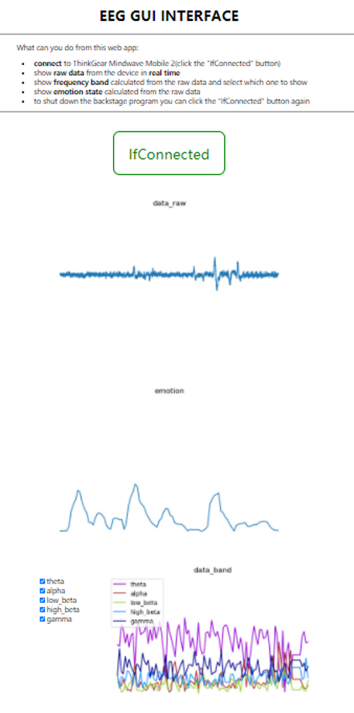

# 依赖库文件

asyncio
websockets
json
sys
mindwavemobile
pyeeg
numpy
threading
matplotlib
BytesIO
base64

# 运行方法

- 在Interface目录中打开终端输入

```
python main.py
```

- 打开main.html

- 打开蓝牙连接mindwave设备
- 点击main.html的Ifconnect按钮

# demo

