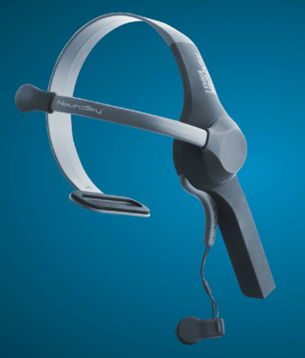

#  脑机接口

> 基于神念科技(NeuroSky)的mindwave MOBILE2 的脑机接口GUI
- algorithm 中存放原始数据和算法代码
- Interface 中存放脑机接口的前后端代码以及算法模型

## 设备

原始数据的采集的是脑门和耳垂的电位差，并通过蓝牙传输数据

## 数据采集

- 多名实验者在观看视频时采集脑电波数据，根据实验者的反应，将数据标1或0（1代表情绪激动，0代表情绪平静）

- 在实际操作中发现数据标注的问题很大
  - 无法实时的标注数据，因为标注有延时，即观测到实验者反应后才标注1
  - 情绪往往是一个很复杂的东西，无法明确界定情绪应该标注为激动还是平静
  - 采集设备比较简陋，实际过程中，脑门的电位采集处由于没有固定，实验者的微小动作可能会导致数据的很大反应

## 算法

>  基于lightgbm("boosting_type" : "gdbt"，"objective" : "binary")

- 特征采集的单位是窗口(1000个采样点)，每20(10/5/1)个采样点进行一次滑窗

- 特征包括 

  - 使用pyeeg(python包)的傅里叶变换作用于原始数据生成5个频域功率数据

    - 4-8Hz theta band ；8-12Hz alpha band；12-16Hz low beta band；16-25 high beta band；

      25-45Hz gamma band

  - 以窗口为单位的6个统计特征 : 偏度 、方差、均值、极差、最大值、最小值

    (在加入统计特征后模型得分明显提高)

- 采用5折交叉验证，因此获得5个模型

- 最终F1-score达到95%以上

## 后端

> 基于python开发
>
> 基于mindwavemobile(python 包)开发

- 连接设备并加载lightgbm模型后，开一个新线程循环读设备传回的原始数据，并且定时根据原始数据计算频段和预测情绪数据，存储到一个全局共享变量中供主线程读取

- 原始数据的采样频率为500Hz，当后端接受到前端的remind时，将全局共享变量中的数据画图用base64编码后传输至前端

## 前端

> 基于Html5和JavaScript开发

- 功能设计
  - 一个Connect按钮用于设备连接和关闭
  - 实时展示3张图片
    - 原始数据
    - 情绪预测数据
    - 5个频段的功率数据
  - 复选框（用于选择展示哪几个频段）

- 设置一个每隔300ms触发的定时器，触发时执行remind()函数
  - 通知复选框的状态
  - 提醒后端应该向前端传送新的数据

## 前后端通信

> 基于python websocket

websocket可以实现双向通信，前后端接受到对方不同的信息后执行不同的操作

### 后端

- connect操作（实现设备初始化连接）
- timer操作（接受到前端的remind后将处理好的数据画图传送给前端）
- change_state操作（根据复选框的状态画不同的频段）

### 前端

- connect 确认连接后改变按钮的颜色
- packet 接受到图片后显示在网页上
- err 设备无法连接通知

